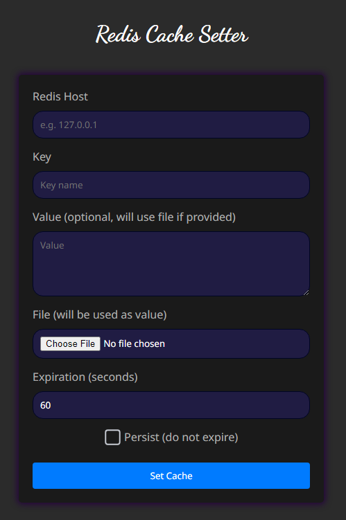

# Redis Cache Setter

A simple tool for setting Redis cache keys via a form. Input the host, key, value (or file), and set the expiration time in seconds or make the key persistent
<div style="text-align: center;">

</div>


## Installation

Check nodejs, if you dont have it install it
https://nodejs.org/en/download/package-manager

```bash
node -v
```

Install the packages with

```bash
npm i
```

## Running

The command will start the server and open the client webpage

### MacOS and Linux

```bash
npm start
```

### Windows

```bash
npm run windows
```